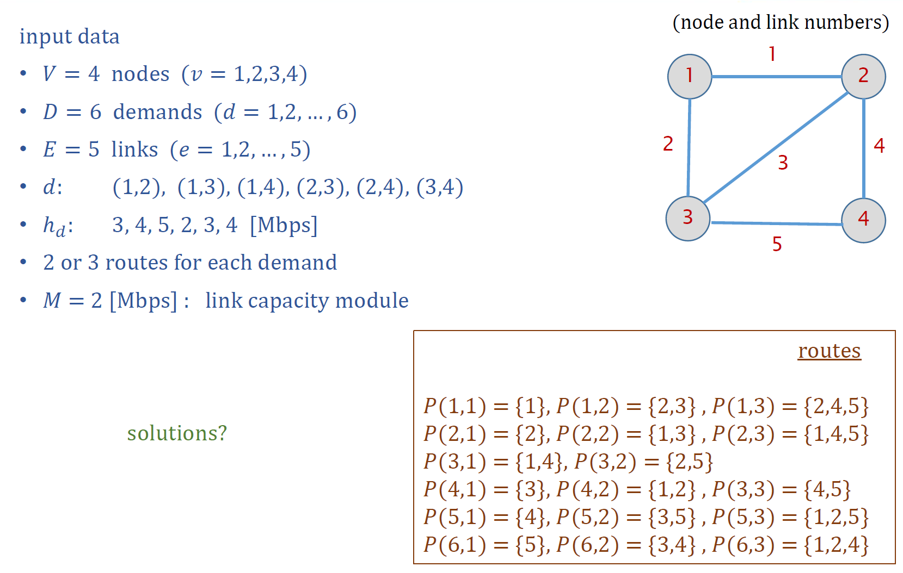
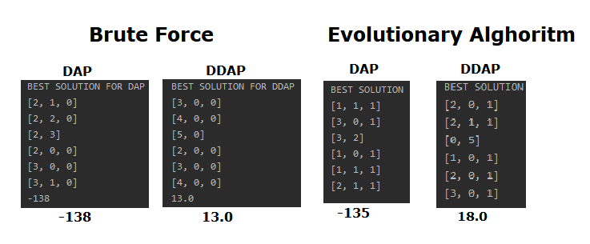

# DAP & DDAP (Brute Force and Evolutionary Alghoritm)
Brute force and Evolutionary Alghoritm to solve dimensioning and demand allocation problem for networks.

DAP
Find allocation of flows 𝑥 that minimizes the max load function.

DDAP
Find allocation of flows 𝑥 that minimizes the cost of links.

## Example Graph Problem

## Menu

## Solutions

